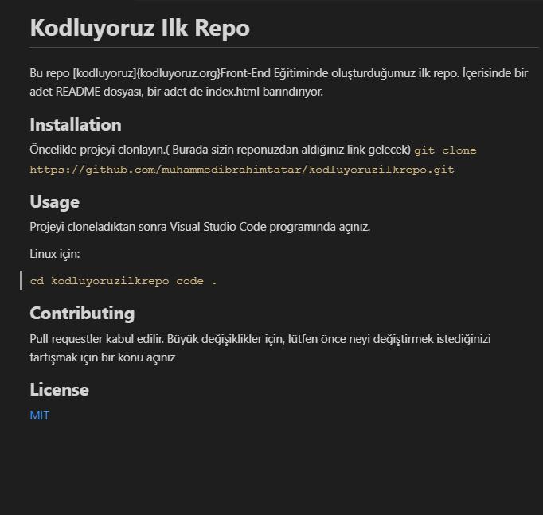

# **Kodluyoruz Ilk Repo**
Bu repo [kodluyoruz]{kodluyoruz.org}Front-End Eğitiminde oluşturduğumuz ilk repo. İçerisinde bir adet README dosyası, bir adet de index.html barındırıyor.

## **Installation**
Öncelikle projeyi clonlayın.( Burada sizin reponuzdan aldığınız link gelecek)
`git clone https://github.com/muhammedibrahimtatar/kodluyoruzilkrepo.git`

## **Usage**
Projeyi cloneladıktan sonra Visual Studio Code programında açınız.

Linux için:

`cd kodluyoruzilkrepo
code .`

## **Contributing**
Pull requestler kabul edilir. Büyük değişiklikler için, lütfen önce neyi değiştirmek istediğinizi tartışmak için bir konu açınız

## **License**

[MIT](mit.com)

